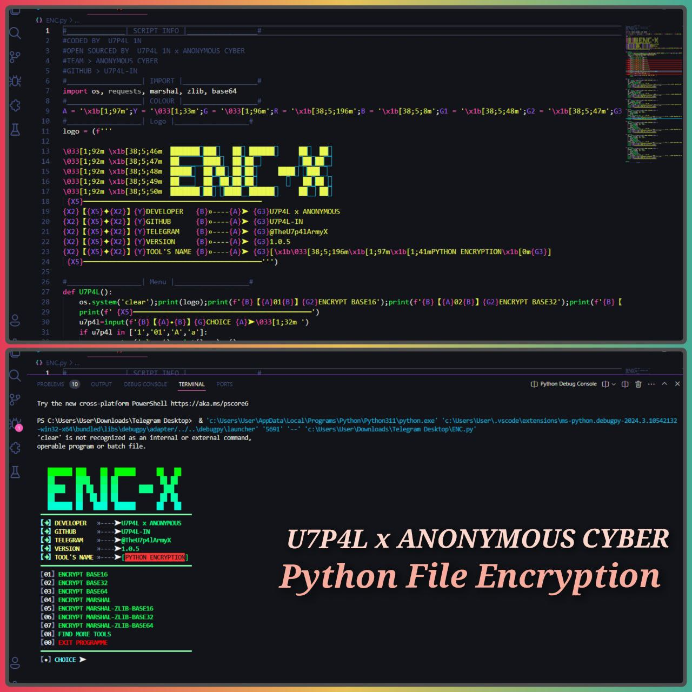
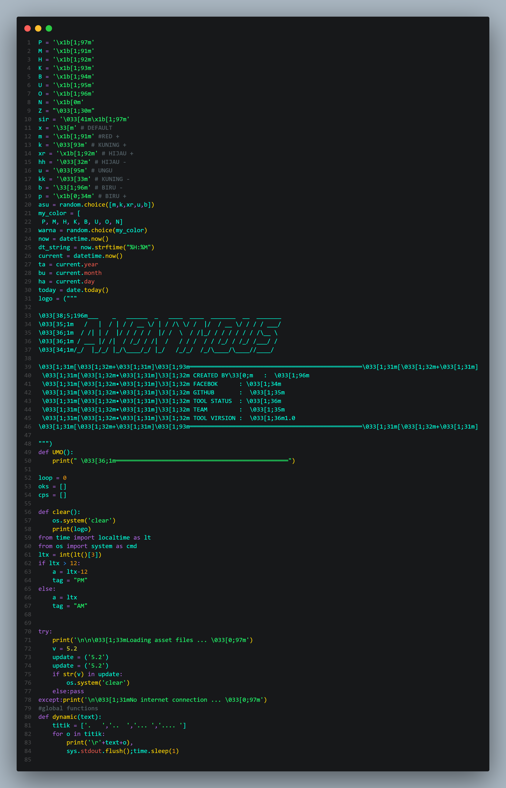
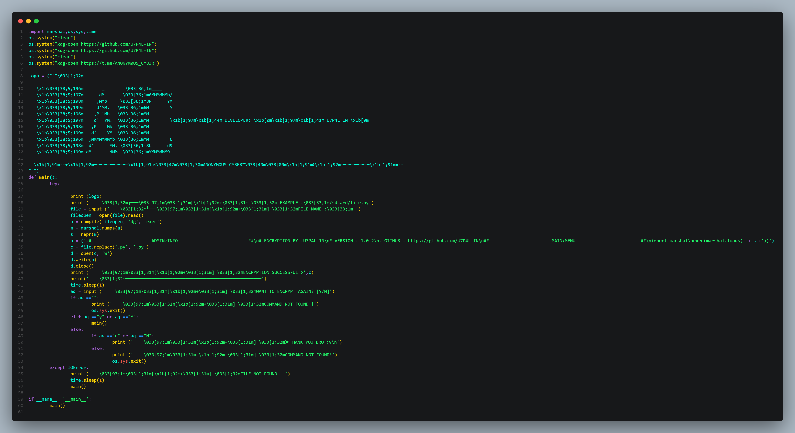

   

      
      
      
      
   

## 500+ WORKING SCRIPT UPLOADED ON THIS REPOSITORY 🎯

## Features -

##  CLONING SCRIPT ZIP FILE 
- 7 ZIP FILE 
- 400+ WORKING SCRIPT 
- LANGUAGE : PYTHON.
- TARMINAL : TERMUX.

##  CLONING SCRIPT FOLDER
- 3 SCRIPT 
- LANGUAGE : PYTHON.
- TARMINAL : TERMUX.

##  MY GIFT SCRIPT  FOLDER
- 5 SCRIPT FILE 
- ALL IS WORKING SCRIPT 
- LANGUAGE : PYTHON.
- TARMINAL : TERMUX

<h5 align="center"><b>ZIP PASSWORD</b></h5>

> [ZIP NAME : GIFT BOX/GIFT BOX 2]  
> PASSWORD: CYBER_XD

### FOLLOW AND INBOX ME FOR ZIP PASSWORD >

  
 

## Screenshots:

## Tools Languages :

<h5 align="center"><b>DESCRIPTION</b></h5>

> [!NOTE]  
> All the tools are belongs to their copyright owner, and this use is in accordance with the terms and conditions of the copyright holder.

# Give A Star ⭐

> You can also give this repository a star to show more people and they can use this repository

